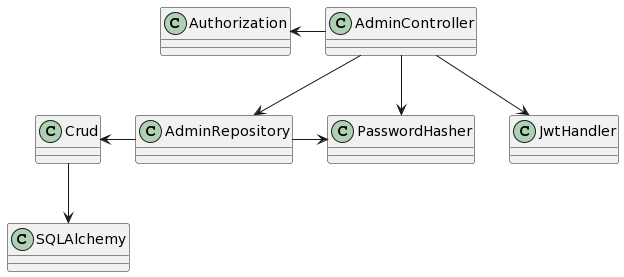
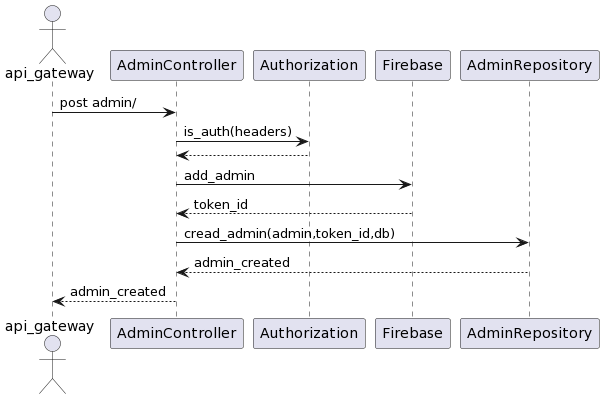

[](https://github.com/Fifiuba/admin-service/commits/main)
[](https://codecov.io/gh/Fifiuba/admin-service)


## Indice de informacion
1. **Instalacion del entorno**
2. **Propósito del servicio de administradores**
3. **Datalles de implementación**


### Instalación del entorno

Version de python
```shell
python --version
Python 3.8.5
 ```
Version de poetry
```bash
poetry --version
Poetry (version 1.2.0)
 ```

Pasos para levantar el servidor local una vez clonado el repo
```bash
poetry install
poetry run uvicorn admin_service.app:app --reload
```

Pasos para correr los test
```bash
poetry run pytest
```

Pasos para correr el formatter
```bash
poetry run black <carpeta>
```

Pasos para correr el linter
```bash
poetry run flake8 <carpeta>
```

Pasos para levantar el entorno Docker
```bash
docker-compose build --no-cache
clear
docker-compose up
```

Pasos para bajar el entorno Docker
```bash
docker-compose down -v
```

### Propósito del servicio de administradores
---

El proposito del servicio de adminsitradores es atender los diferentes request necesarios que poseen los administradores, este servicio otorga la capacidad de crear/leer/editar y eliminar diferentes administradores.

Haciendo uso de la autenticacion de Google Firebase para su desarrollo

### Detalles de implementación
---
Diagrama de clases general



Diagrama de secuencia de una creacion de administrador


